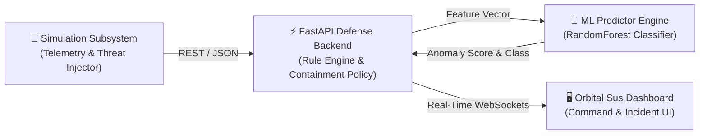

# 🛸 Orbital Sus — AI-Assisted Cyber-Physical Defence System for Simulated Spacecraft

An autonomous cyber-physical defence and threat containment platform designed for simulated satellite constellations. The system detects telemetry anomalies, identifies cyber threats (such as command injection, spoofing, and ground-station hijacking), and demonstrates automated containment and recovery protocols.

---

## 🌟 Architecture & Core Modules



### Module Overview

1. **`backend/` (FastAPI Defense System)**
   - REST API endpoints for telemetry ingestion (`/api/telemetry`), system status (`/api/status`), and incident logs (`/api/alerts`).
   - Automated containment engine executing response states: `ALERT`, `INCREASE_MONITORING`, `BLOCK_COMMAND`, `ISOLATE_CHANNEL`, `SAFE_MODE`, `RECOVERY`.
   - Real-time WebSocket event broadcaster (`/ws/telemetry`).

2. **`simulation/` (Spacecraft Telemetry & Threat Injector)**
   - High-fidelity spacecraft physics simulation (temperature, battery discharge/charge curves, solar array generation, reaction wheel angular rates, and pointing attitude deviation).
   - Dynamic threat injection engine supporting `NORMAL`, `CYBER_ATTACK`, `HARDWARE_FAULT`, and `ENVIRONMENTAL_DISTURBANCE` scenarios.

3. **`ml/` (Machine Learning Anomaly Detection)**
   - Synthetic dataset generator (`dataset.py`) generating multi-variate telemetry vectors.
   - `RandomForestClassifier` model (`train.py`) producing anomaly scores and threat category predictions.
   - Inference predictor (`predictor.py`) integrated into the telemetry processing pipeline.

4. **`Orbital Sus/` (Interactive Command Dashboard)**
   - Responsive web dashboard (`index.html`) featuring live gauge monitors, WebSocket event stream, threat injector control panel, and incident audit log table.

---

## 📋 Shared Data Contract

| Field Name | Type | Description |
| :--- | :--- | :--- |
| `satellite_id` | `str` | Satellite identifier (e.g. `SAT-01`) |
| `timestamp` | `str` | ISO 8601 formatted timestamp |
| `temperature` | `float` | Subsystem temperature (°C) |
| `battery` | `float` | State of charge percentage (0-100%) |
| `solar_power` | `float` | Solar panel power output (Watts) |
| `gyro_x`, `gyro_y`, `gyro_z` | `float` | Gyroscope angular rate components (rad/s) |
| `attitude` | `float` | Attitude pointing error (degrees) |
| `cpu_usage` | `float` | OBC CPU load percentage (0-100%) |
| `command_type` | `str` | Command authorization state (`AUTHORIZED`, `UNAUTHORIZED`, `SPOOFED`) |
| `command_frequency` | `int` | Incoming ground commands per second |
| `communication_anomaly` | `bool` | Signal integrity anomaly flag |

---

## 🛠️ Quickstart Guide

### 1. Prerequisites
Ensure you have Python 3.9+ installed.

### 2. Install Dependencies
```bash
cd backend
pip install -r requirements.txt
pip install scikit-learn pandas
```

### 3. Start the FastAPI Backend Server
```bash
cd backend
uvicorn main:app --reload
```
- Access REST API Docs: `http://127.0.0.1:8000/docs`
- Open Command Dashboard: `http://127.0.0.1:8000/dashboard`

### 4. Train the ML Model (Optional)
```bash
cd ml
python train.py
```

### 5. Launch Spacecraft Simulator & Threat Injector
```bash
cd simulation
python runner.py
```

---

## 🛡️ Response Containment Matrix

| Threat Level | Classification | Containment Action |
| :--- | :--- | :--- |
| `LOW` | `NORMAL` | `ALERT` |
| `MEDIUM` | `CYBER_ANOMALY` | `INCREASE_MONITORING` |
| `HIGH` | `CYBER_ANOMALY` | `BLOCK_COMMAND` |
| `CRITICAL` | `CYBER_ANOMALY` | `ISOLATE_CHANNEL` |
| `HIGH` / `CRITICAL` | `HARDWARE_FAULT` | `SAFE_MODE` |

---

## 📜 License
MIT License. Built for Spacecraft Cyber Security & Defense System Simulation.
